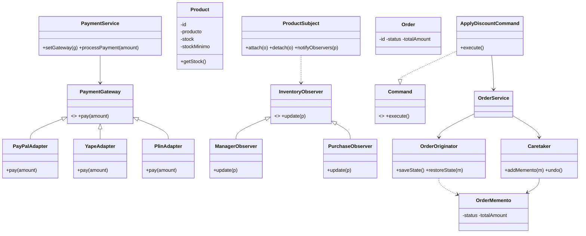
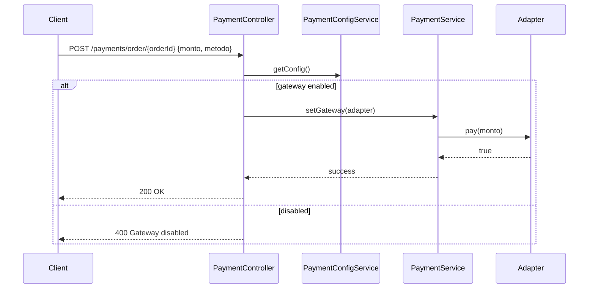

# Diseño técnico — SUSTI.PATRONES

## Resumen ejecutivo ✅
El proyecto implementa una plataforma de gestión de ventas e inventario para pymes. Se aplican patrones estructurales y de comportamiento (Adapter, Proxy, Observer, Command, Memento, Strategy, Iterator) y los principios GRASP (Controller, Creator, Information Expert, Low Coupling, High Cohesion, Polymorphism, Indirection, Protected Variations, Pure Fabrication) para asignar responsabilidades con claridad, escalabilidad y mantenibilidad.

---

## Mapeo RF → Patrón → Justificación (GRASP)

- RF1 (Pagos) → Adapter
  - Justificación: *Protected Variations* para aislar diferencias entre pasarelas; *Polymorphism* para intercambiar adaptadores sin cambiar la lógica del dominio. `PaymentService` actúa como **Controller** / **Information Expert** para procesar pagos.

- RF2 (Habilitar/Deshabilitar pasarelas) → PaymentConfig + Persistence
  - Justificación: **Creator** para `PaymentConfigService` que conoce la persistencia; persistencia reduce errores y facilita toggles desde UI.

- RF3–RF4 (Reportes) → Proxy
  - Justificación: **Indirection** para separar validación de credenciales/roles del cálculo del reporte; Proxy hace la verificación y delega a `FinancialReportService`.

- RF5–RF6 (Inventario) → Observer
  - Justificación: **Information Expert**: `Product` y `ProductSubject` conocen el stock; **Low Coupling**: notificación desacoplada de acciones de UI o de negocio; `StockObserverService` persiste alertas (Pure Fabrication).

- RF7–RF8 (Pedidos) → Command + Memento
  - Justificación: **Pure Fabrication** `CommandInvoker` guarda historial de comandos; **Creator** `OrderService` crea y gestiona órdenes; `Caretaker` y `Originator` implementan memento para undo.

- RF9–RF10 (Políticas de precios) → Strategy
  - Justificación: **Polymorphism** para cambiar la estrategia de precios en tiempo de ejecución; `PricingContext` aplica la *Strategy*.

- RF11–RF12 (Catálogo) → Iterator
  - Justificación: **Low Coupling** y **High Cohesion**; `ProductIterator` oculta estructura interna y mejora paginación/filtrado.

---

## Diagrama de clases (Mermaid)

---

## Secuencia (Pago con pasarela habilitada)

---

## Responsabilidades y GRASP por componente (tabla corta)

- `PaymentService` — Controller/Information Expert; delega a adaptadores (Low Coupling).
- `PaymentConfigService` — Creator/Information Expert para persistencia de toggles.
- `ProductSubject` — Pure Fabrication/Indirection que notifica observers.
- `StockAlertService` — Pure Fabrication para registrar alertas (separa persistencia de la lógica de notificación).
- `OrderService` — Creator/Controller; implementa Memento (Originator/Caretaker) para restauración de estado.

---

## Pruebas y validación
- Integración: Payment integration testing (disable+enable), StockAlert integration test (crear producto con stock < stockMinimo genera alerta).
- Unit: AuthService, JwtUtil, PaymentService (mocks), ProductService (observer checks), OrderService (Memento flow).

---

## Próximos pasos sugeridos
1. Pulir autenticación (hash de passwords, roles, tests de seguridad).  
2. Implementar la UI (login, panel admin para toggles de pasarelas, alertas).  
3. Añadir CI y badge de estado (ya configurado).  
4. Preparar presentación técnica (slides) y un PDF con diagramas.

---

*Documento generado automáticamente — se puede ampliar con diagramas exportados y documentación detallada por RFC.*
